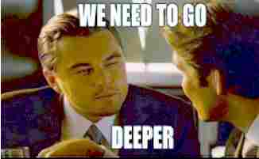

# 新手村指南（A roadmap to academic excellence for newbies）

[Dr. Zhang](http://zhangys.org.cn) 整理，不定期更新。 

图例说明：

    ⬜ Mandatory  应掌握的基础知识/技能  
    🔳 Optional  根据个人选定的具体研究方向  
    1️⃣ 2️⃣ 3️⃣ 4️⃣ 5️⃣ 6️⃣ 7️⃣ 8️⃣ 9️⃣  完成该任务学习所需的标准时间（周为单位）  
    🌞 Recommended  推荐必看的资源

## 理论篇

### 线性代数 ⬜2️⃣

https://www.bilibili.com/video/BV1ib411t7YR

+ 向量/矩阵运算； 
+ 基，Orthonormal basis；
+ 逆矩阵，广义逆矩阵；
+ 协方差矩阵，SVD
+ [向量的叉积，齐次坐标和齐次变换](https://www.bilibili.com/video/BV1HD4y117JW/)🔳

### 概率论和数理统计 ⬜4️⃣

+ [概率论-基本概念](https://www.bilibili.com/video/BV1Nh411Y7m3)

    随机试验、样本空间、随机事件、概率、条件概型与乘法公式、全概率公式、[贝叶斯定理](https://www.bilibili.com/video/BV1Nh411Y7m3/)、贝叶斯分类器、生成模型、频率学派 vs 贝叶斯学派

+ [概率论-随机变量及其分布](https://www.bilibili.com/video/BV1F3411p7DU/)

    离散型随机变量，0-1分布、泊松分布、二项分布；连续性随机变量，均匀分布、指数分布、正态分布；概率密度函数，分布函数。 随机变量的数字特征：期望、方差、协方差、相关系数、矩。[大数定律和蒙特卡洛](https://www.bilibili.com/video/BV1JB4y1M7sM)；中心极限定理

+ [数理统计-抽样分布](https://www.bilibili.com/video/BV1jF411x7ym/)|[参数估计](https://www.bilibili.com/video/BV1HY411n79i/)

    总体、样本、统计量、抽样分布：卡方分布、t分布、F分布； 参数估计。点估计：矩估计法、最大似然法；区间估计：单侧置信区间、双侧置信区间

+ [数理统计-假设检验](https://www.bilibili.com/video/BV1nS4y1g7xY/)

    拒绝域法、p值法、两类错误、效能分析; 正态总体的均值和方差的假设检验

+ [降维](https://www.bilibili.com/video/BV1PS4y1N78d/)

    降维、PCA、tSNE、UMAP、因子分析

+ [统计图形](https://www.bilibili.com/video/BV1hh411v7vV/)

    散点图、直方图、QQ-Plot、PP-Plot等

+ [基于方差的分析系列](https://www.bilibili.com/video/BV14A4y1D7xs/)

    方差分析（ANOVA）；相关分析；回归分析；GLzM、ANCOVA、multi-way ANOVA、MANOVA

+ [聚类](https://www.bilibili.com/video/BV1w34y147sB/)

    K-means + HC + GMM + DBSCAN + Spectral Clustering

+ [非参数检验](https://www.bilibili.com/video/BV1DU4y1d7HA/)

    分布拟合检验（卡方拟合检验）、秩和检验、 符号秩检验、 二项式检验、 列联表检验、 符号检验、 McNemar检验、 Kruskal Wallis检验、 Cochran Q检验

+ [生存分析](https://www.bilibili.com/video/BV1nZ4y1B7Ey/)

    Kaplan-Meier、 hazard ratio、 survival analysis、 logrank test

+ [Bootstrap](https://www.bilibili.com/video/BV1FL411A7gk/)

    Bootstrap，置信区间，集成学习，Adaboost

+ [神经网络系列](https://www.bilibili.com/video/BV1FL411A7gk/)

    感知机、深度学习、神经网络发展史、ANN in SPSS

+ [时间序列分析](https://www.bilibili.com/video/BV1EY4y1b7f7/)

    ACF、PACF、AR、MA、ARMA、稳态过程、ARIMA、SARIMA、ARCH等

+ [异常检测](https://www.bilibili.com/video/BV1Py4y1U7uv/)

    Multivariant Gaussian Distribution

### 机器学习 ⬜8️⃣

🌞 https://www.coursera.org/learn/machine-learning   

+ 回归

    线性回归模型（单变量、多变量）；代价函数；梯度下降法；线性代数回顾：矩阵与向量；矩阵运算；正规方程；多项式回归

+ 分类

    Logistic回归模型；Sigmoid激活函数；二分类；多分类。欠拟合/过拟合；正则化（regularization）。Hinge Loss和SVM决策边界。

    核（kernel）🔳：各类核，RKHS(泛函分析)，多核学习。

    神经网络：前向传播；反向传播。 决策树：Info Gain , Gini Impurity；随机森林；集成学习（bagging，boosting。贝叶斯分类器。[KNN](https://www.bilibili.com/video/BV1Zq4y177pm/)； [距离](https://www.bilibili.com/video/BV1PV41177br/)；
    
    随机权神经网络 NNRW 🔳：ELM, RVFL

+ 模型选择及模型评估
  
    偏差(bias)/方差(variance)；模型选择；训练集/交叉验证集/测试集；学习曲线；不均衡的数据；查准率/查全率/F1-Score；Cross Validation

### [文本挖掘](https://www.bilibili.com/video/BV1hK4y1f75N/) 🔳4️⃣

+ 特征提取：将文本转化为计算机可处理的向量形式; 单词表征：Word Embedding，TF-IDF; 文档表征：Bow(Bag of word), N-gram; 文本分类，情感分析（polarity: negative 0-1 positive）
+ 文档主题模型（Topic Model): LDA，NMF，Clustering； Word Embedding, RNN, LSTM, GRU，Attention
+ Python 爬虫
+ [关联挖掘](https://www.bilibili.com/video/BV1FK4y1j7Ph/)
+ 本体、语义网络、知识图谱
+ 时空可视化
+ 情感分析

### 集成学习 🔳4️⃣

+ Bagging / Boosting / Stacking
+ 经典模型：RF、-Boost系列

### 信号处理 🔳6️⃣

+ 香农信息论
+ 采样定理
+ 压缩感知

## 工程篇

### Python ⬜1️⃣  

🌞 https://www.w3school.com.cn/python/index.asp 

+ Scikit-learn 机器学习库

+ Numpy 线性代数库

+ Matplotlib 可视化库

+ Pandas 数据操作库

+ Scipy 科学计算库，主要关注Scipy.stats统计功能

### 深度学习 🔳6️⃣

🌞 https://www.bilibili.com/video/BV1Wv411h7kN  
🌞 https://distill.pub/

+ 梯度下降
    AdaGrad, RMSProp, Adam

+ 经典模型
    CNN，RNN，GNN, [Attention](https://www.bilibili.com/video/BV1tb4y1t7RF/)

+ 主流技术框架
    pyTorch, keras + tensorflow

+ 任务
    图像分类、目标检测、图像分割、风格迁移、样本生成

+ 可解释性

### AutoML 🔳2️⃣

+ Autokeras

### 全栈工程师 🔳

+ SQL https://www.w3school.com.cn/sql/index.asp
+ 后台 ASP.Net MVC C# / Java / php
+ 前端 HTML / CSS / JS https://www.w3school.com.cn/html/index.asp
+ Android App, Android Studio
+ Wechat App

### 物联网\端智能 🔳

+ 单片机系列：[Arduino、ESP32](https://www.bilibili.com/video/BV1jT411c7TE/)、各类sensor、C语言

+ [Raspberry Pi](https://www.bilibili.com/video/BV1XB4y1H7J5/)： Linux, Raspbian，GPIO

+ 轻量级模型及推理框架：mobilenet, efficientnet, tflite, tfjs等

## 工具篇 ⬜

### IDE

+ Jupyter Notebook。markdown语法及[数学公式语法](latex_math_symbols.pdf)
+ Visual Studio Code 或 宇宙最强 Visual Studio

### English 

+ 观看youtube、coursera等的英文教程，锻炼英文思维，掌握学术词汇和表达方式。
+ Spelling Checker, e.g., Grammarly

### 信息检索

+ 日常使用bing或google，以英文关键词检索。技术类StackOverflow，学术类quora, stats.stackexchange.com, wikipedia, 知乎等
+ 英文文献检索：Google Scholar, Elsevier ScienceDirect

### 引文管理

+ Zotero

### 版本管理

+ [Github](https://www.bilibili.com/video/BV1Lg41117Ay/), [多人协作操作说明](github_manual.pdf)

### 中文资源

+ 全国优秀学位论文库

## 心灵鸡汤 

+ 做”一个脱离了低级趣味的人”，不要【长时间】沉溺于低层次快乐中。
+ 实践和参与。杜绝无所事事、没有深入参与感的精神内耗。
+ 劳逸结合，找到自己的节奏。但过的【太】安逸舒适时，往往是走下坡路的信号。
+ 编程技术方面的学习，必须独自完成相应的程序。杜绝浅尝辄止，死磕细节，强化自己的执行力。
 

